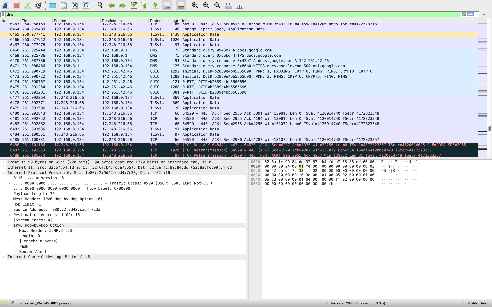
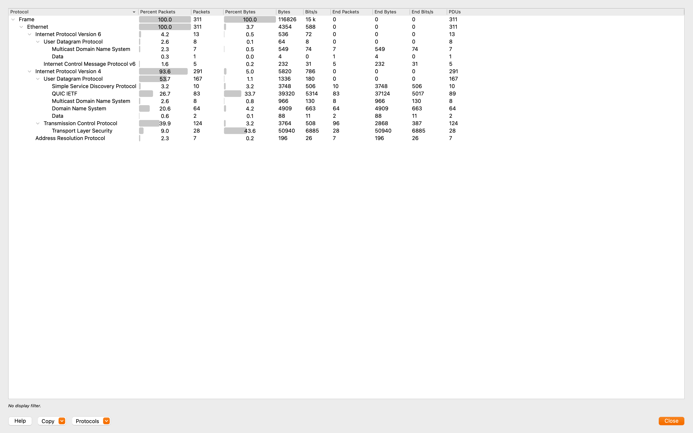
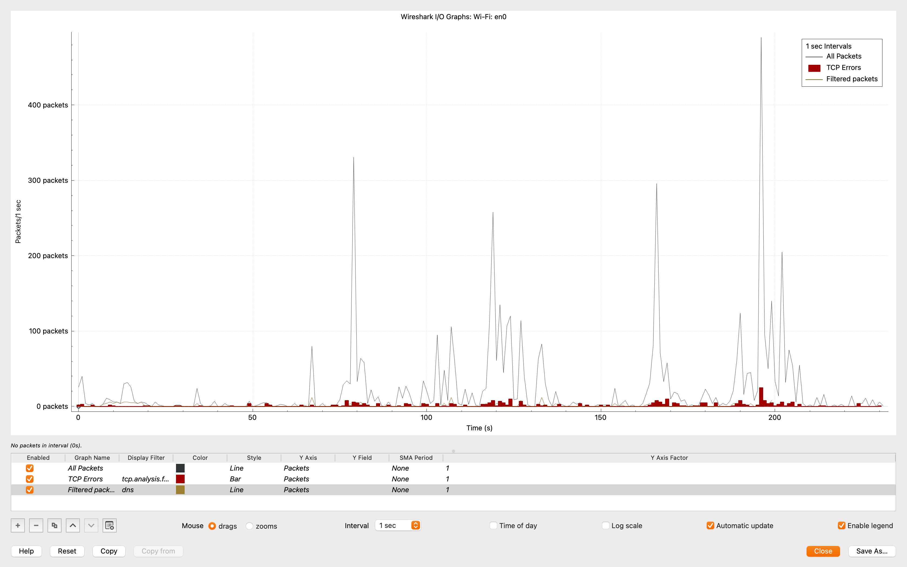

# DNS Anomalies Analysis

**Date:** 2025-09-02  
**Interface:** Wi-Fi (en0)  
**Scenario:** Repeated failed DNS queries to random subdomains of `example.com` to simulate suspicious activity.

---

## Goal
Show how Wireshark can detect **abnormal DNS traffic patterns** such as excessive failed queries, which may indicate malware using a Domain Generation Algorithm (DGA) or misconfigured systems.

---

## Observations

### 1. Packet List (NXDOMAIN Responses)
- Multiple queries to domains like `a94f29becff.example.com` and `c30693636f.example.com`  
- Responses = **"No such name" (NXDOMAIN)** from the DNS server  
- This is not normal for typical browsing, which usually queries well-known domains.  

Screenshot: 

---

### 2. Protocol Hierarchy
- UDP/IPv4 traffic is dominant due to the DNS queries.  
- DNS accounts for a high percentage compared to baseline browsing.  
- This shift highlights the anomaly: too many DNS requests vs. other traffic.  

Screenshot: 

---

### 3. Conversations
- UDP conversations (client → DNS server) show **repeated lookups** with minimal data transferred.  
- Unlike baseline, where DNS exchanges were few and tied to active browsing.  

Screenshot: 

---

### 4. I/O Graph
- Clear bursts of DNS packets within short time intervals.  
- These spikes contrast the baseline, which had smoother traffic patterns.  
- Such bursts could indicate automated queries (botnet/malware).  

Screenshot: 

---

## Key Takeaways
- **Baseline:** Few DNS lookups, legitimate responses (A/AAAA records).  
- **Anomalous Traffic:** Dozens of DNS queries → mostly NXDOMAIN responses.  
- This behavior is a red flag for:
  - Malware using DGAs to locate Command & Control servers.  
  - Misconfigured software spamming invalid DNS queries.  
- Wireshark’s filters and statistics clearly highlight the anomaly.

---

