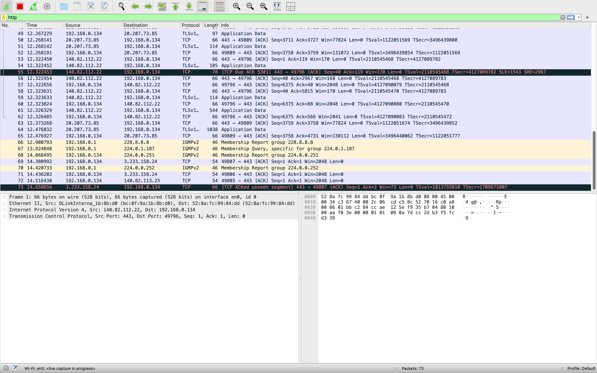
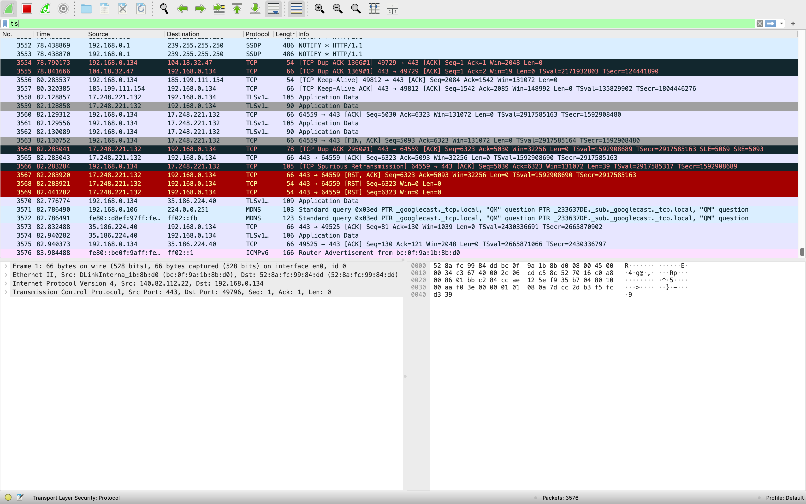
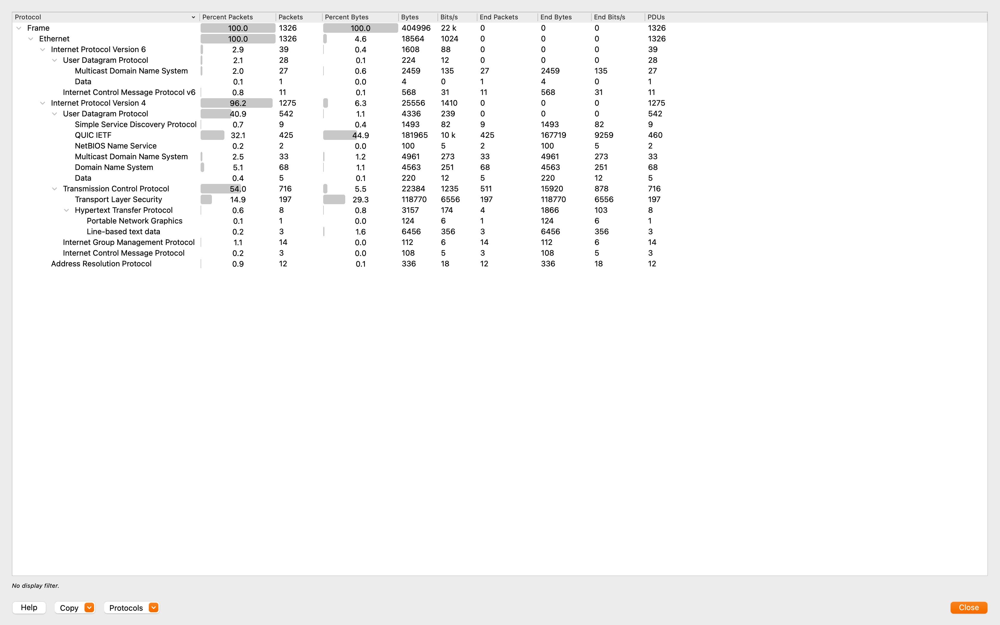

# HTTP vs HTTPS Analysis

**Date:** 2025-09-02  
**Interface:** Wi-Fi (en0)  
**Capture File:** captures/http-vs-https.pcapng  

---

## Goal
To demonstrate the security differences between **HTTP** (cleartext) and **HTTPS** (encrypted with TLS).  
This highlights why HTTPS is the standard for secure web communication.

---

## Summary Table

| Metric                  | Value                                   |
|--------------------------|-----------------------------------------|
| Total Packets            | ~1,300                                  |
| Protocol Breakdown       | ~55% TCP, ~40% TLS/HTTPS, ~5% HTTP      |
| HTTP Requests            | Visible headers, readable in plaintext  |
| HTTPS Sessions           | Encrypted traffic w/ TLS handshake      |
| Security Observation     | HTTP traffic is insecure → data visible |

## Observations

### 1. HTTP (Unencrypted)
- Capturing traffic while browsing `http://neverssl.com` revealed **readable HTTP GET requests**.  
- Headers such as `Host`, `User-Agent`, and `Accept-Language` were fully visible in the packet details.  
- Anyone sniffing the network could easily view these requests.  

Screenshot: 

---

### 2. HTTPS (Encrypted with TLS)
- Capturing traffic while visiting `https://example.com` showed **TLS handshake messages** (Client Hello, Server Hello, Certificate).  
- Unlike HTTP, the request/response contents were **not visible**.  
- Only metadata (IP addresses, TLS handshake parameters) was exposed — the actual data was encrypted.  

Screenshot: 

---

### 3. Protocol Hierarchy
- In Protocol Hierarchy stats, HTTP traffic appeared under **Hypertext Transfer Protocol**, with visible content.  
- HTTPS traffic appeared under **TLSv1.2 / TLSv1.3**, hiding user data.  
- This provides a clear contrast between plaintext and encrypted communication.  

Screenshot: 

---

## Key Takeaways
- **HTTP is insecure**: Data travels in plaintext, making it vulnerable to sniffing, credential theft, and man-in-the-middle attacks.  
- **HTTPS is secure**: TLS encrypts traffic, protecting the confidentiality and integrity of user data.  
- Wireshark clearly shows the difference:  
  - HTTP = readable requests/responses  
  - HTTPS = only encrypted TLS records  

---

## Real-World Relevance
- This experiment demonstrates why modern browsers warn against HTTP sites.  
- Employers and security teams emphasize TLS adoption as a critical defense against eavesdropping.  
- Monitoring HTTP vs HTTPS traffic is a common task for **network analysts** and **SOC teams**.  

