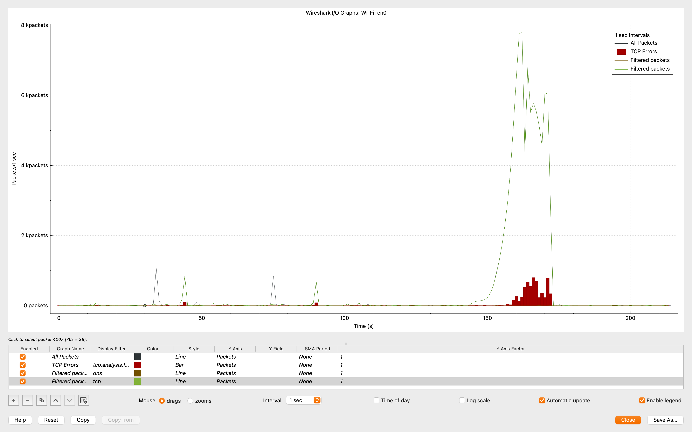
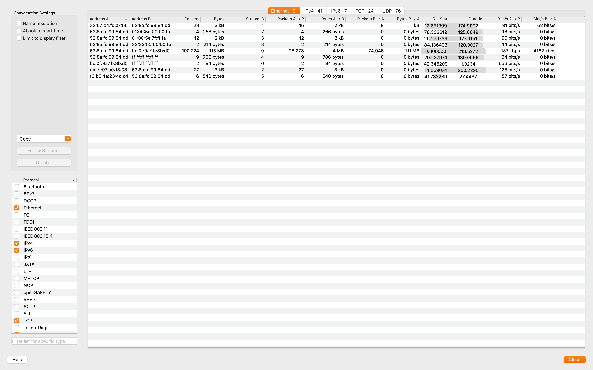
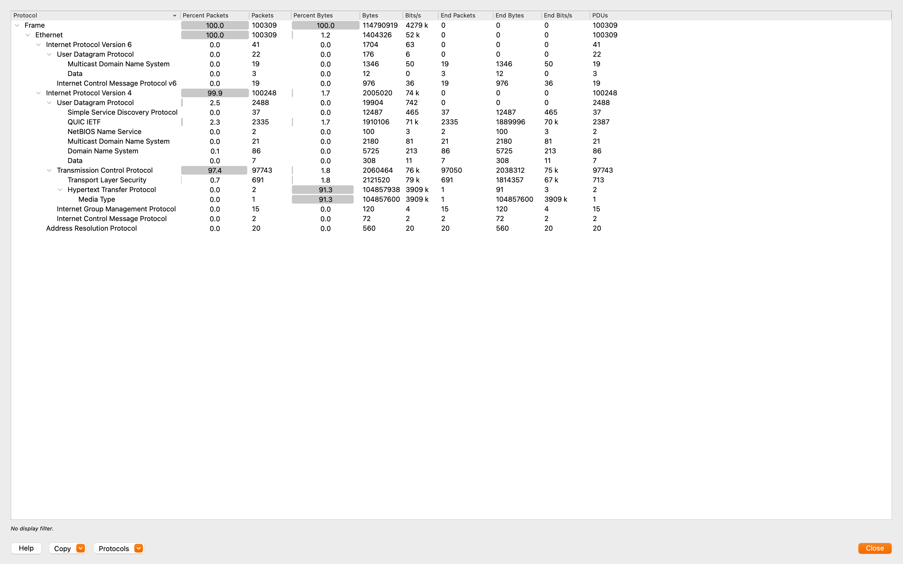

# Large File Transfer Analysis

**Date:** 2025-09-02  
**Interface:** Wi-Fi (en0)  
**Capture File:** captures/large-transfer-2025-09-02.pcapng

---

## Goal
To analyze the impact of a large file transfer on network traffic and observe throughput, retransmissions, and protocol usage during the session.

---

## Observations

### 1. Packet Capture
- Total packets: ~100,309  
- TCP accounted for ~97% of packets.  
- The bulk of traffic came from a single large TCP stream associated with the file transfer.

### 2. I/O Graph
- Clear spike in traffic observed during transfer.  
- Peak packet rate: **~8,000 packets/sec**.  
- TCP retransmissions visible, showing occasional recovery.  
- Shows sharp contrast between idle state and active transfer.  

### 3. Conversations
- One dominant TCP conversation:  
  - Packets: ~100,224  
  - Total transfer: ~115 MB  
  - Throughput: ~4 Mbps upstream, ~4162 kbps downstream  
- Indicates a sustained bulk transfer session.  

### 4. Protocol Breakdown
- IPv4: ~99.9%  
- TCP: ~97.4% of total traffic  
- Application data transmitted via TLS (encrypted).  
- UDP/DNS present only as background noise.  

---

## Conclusion
The experiment demonstrates how a large file transfer dominates network traffic:  
- TCP streams carry the bulk of data.  
- Throughput spikes are visible in the I/O graph.  
- Conversations analysis shows a single TCP session responsible for the majority of packets and bytes.  
- Protocol stats confirm TCP/IPv4 as the backbone for reliable bulk transfers.

