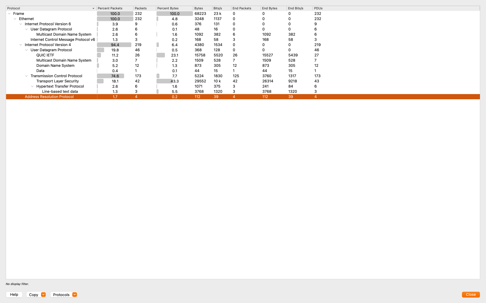
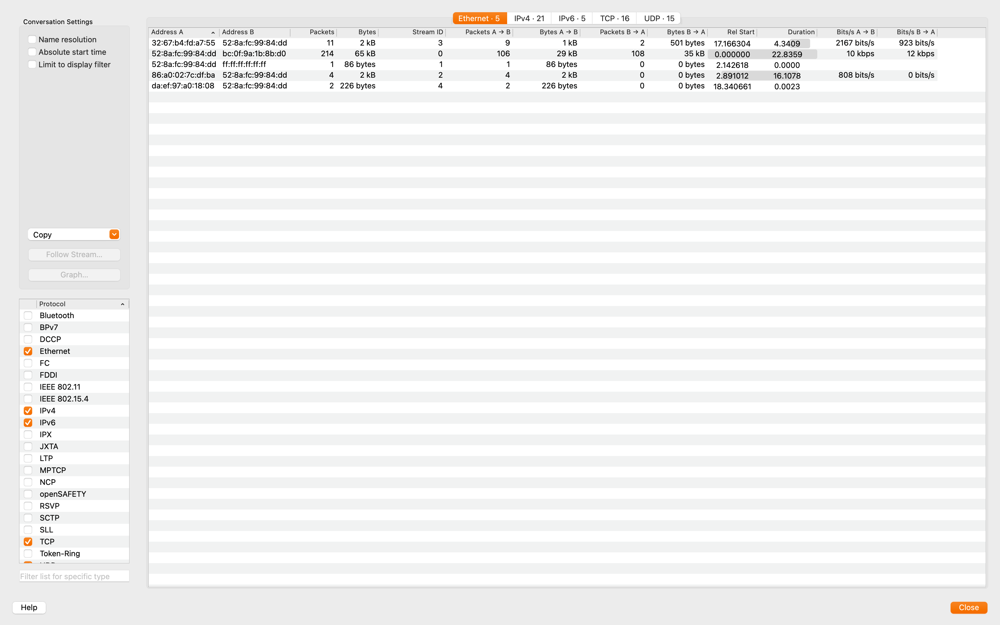

# Suspicious User-Agent Traffic Analysis

**Date:** 2025-09-02  
**Interface:** Wi-Fi (en0)  
**Capture File:** captures/suspicious-ua.pcapng  

---

## Goal
To detect and analyze unusual HTTP requests with suspicious or uncommon User-Agent strings.  
This simulates how attackers or malware may use non-standard User-Agents for reconnaissance or data exfiltration.

---

## Summary Table

| Metric                  | Value                                   |
|--------------------------|-----------------------------------------|
| Total Packets            | ~232                                   |
| Protocol Breakdown       | ~75% TCP (TLS/HTTPS), ~20% UDP/QUIC     |
| Suspicious Traffic       | HTTP (unencrypted) with odd User-Agents |
| Normal UA Example        | Mozilla/5.0 (Chrome, Firefox, Safari)  |
| Suspicious UA Example    | Non-standard/incomplete fields          |

## Observations

### 1. HTTP Requests (Filtered by `http`)
- Captured several HTTP packets with visible request headers.  
- Some requests used **non-standard or incomplete User-Agent fields**, which do not match common browser signatures.  
- Legitimate traffic usually has recognizable strings like *Mozilla/5.0 (Chrome, Firefox, Safari)*.  
- Suspicious UA packets are often a red flag for:
  - Automated scripts / crawlers  
  - Malware beaconing  
  - Reconnaissance tools (e.g., curl, custom Python requests)  

Screenshot:  
  

---

### 2. Protocol Breakdown
- **HTTP (unencrypted)** present in the capture despite HTTPS being standard today.  
- TLS/QUIC traffic dominates normal web activity, but the **HTTP portion stood out** with unusual headers.  
- Protocol statistics confirm:
  - ~75% TCP traffic (normal HTTPS/TLS)  
  - ~20% UDP/QUIC (modern browsers)  
  - **HTTP/Line-based text data** (~2–3%) flagged as suspicious.  

Screenshot:  
  

---

### 3. Conversations
- Source: `192.168.0.134` (local host) → multiple external IPs.  
- Conversations show a few KB of HTTP traffic compared to MBs of TLS traffic.  
- Indicates these suspicious requests were **low-volume but distinct**.  

Screenshot:  
  

---

### 4. I/O Graph
- Most traffic is TLS/QUIC (normal browsing).  
- HTTP traffic spikes briefly, aligning with the suspicious UA requests.  
- TCP error bars confirm retransmissions, possibly due to blocked or unresponsive endpoints.  

Screenshot:  
  

---

## Conclusion
The capture highlights the difference between **normal encrypted browsing** and **suspicious HTTP traffic**:
- Unusual User-Agent headers are a strong anomaly.  
- Low-volume HTTP requests amid encrypted traffic stand out in protocol and I/O analysis.  
- In real-world monitoring, such traffic would warrant deeper inspection (e.g., packet payload analysis, threat intelligence lookups).
